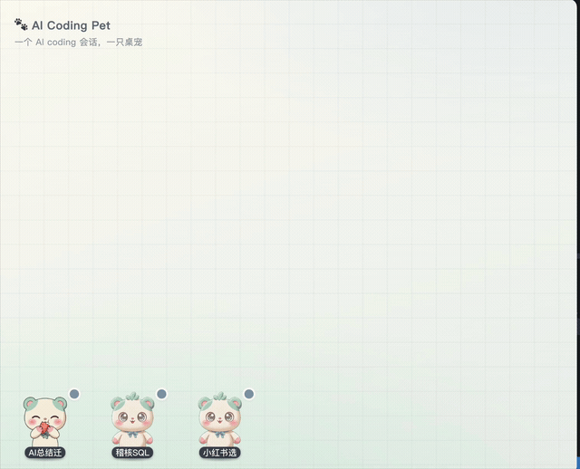
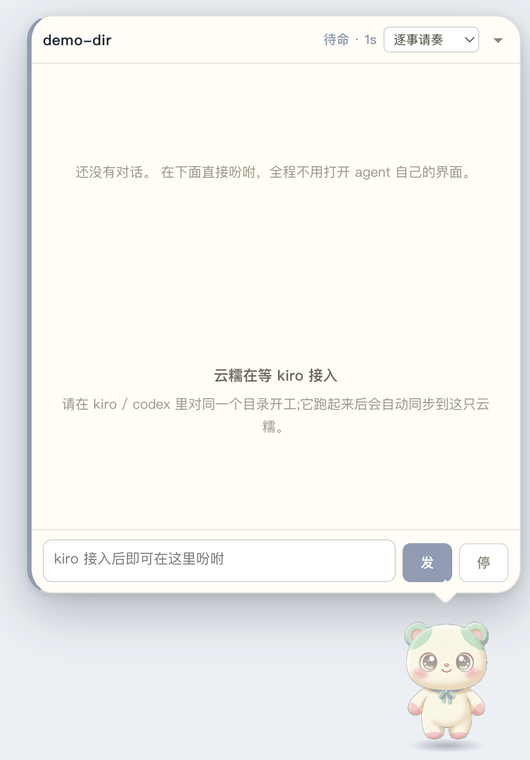

# AI Coding Pet 🐾

> 一个 AI coding 会话，一只桌宠。宠物待在屏幕角落，把「AI 现在在干什么、要不要你拍板」变成一眼就懂的样子——不用一直盯着 agent 的窗口。

一次开好几个 AI coding 会话时，最难受的是：哪个跑完了？哪个卡住等你点确认？哪个正要干危险的事？AI Coding Pet 给每个会话一只小宠物站在桌面上，用**状态动画 + 危险度颜色 + 阻塞式审批**把这些信息推到你眼前。

## 30 秒看懂

<!-- DEMO_VIDEO_PLACEHOLDER -->
<!-- 录屏后把下面这行替换成真实文件： -->
> 📹 30 秒演示视频即将补上（`npm run pitch` 自动跑完这段）。

演示里发生的四件事：

1. **三只宠物并排登场**，脚下名牌各不同——前两只是同一个项目，靠会话标题区分，不会认错。
2. **点开会话面板**：不用打开 AI 的界面，也能看到它读了什么、写了什么、跑了什么命令，每行按危险度标色（蓝=只读 / 黄=写入 / 红=危险）。
3. **两个会话同时弹「请奏」**：各自头上挂各自的审批卡片，驳回其中一个不影响另一个准奏。
4. **干完活跳起来收尾**。



## 核心能力

| 能力 | 说明 |
|---|---|
| **一会话一宠物** | 每个 AI coding 会话对应一只宠物，并排站在屏幕角落 |
| **会话身份名牌** | 多只并排时脚下显示会话标题，同项目多会话也分得清 |
| **状态动画** | 待命 / 运行中 / 请奏 / 请择 / 完成 / 陈旧 / 退出 / 瘫，八态各有动画；运行中还会随机插播冲刺 / 抹汗 / 踉跄 |
| **阅读流** | 会话面板里同步 AI 读了/写了/跑了什么，不用切到 AI 自己的界面 |
| **危险度三色** | 每个动作按危险度标色：只读=蓝、写入执行=黄、命中破坏性特征（`rm -rf`/`git push --force`/`drop table`…）=红 |
| **请奏（阻塞审批）** | 危险操作执行前拦住、弹到宠物身上等你准奏/驳回；驳回则那次调用不执行。**默认关闭**，`fail-open`（桌宠没开/超时一律放行） |
| **多会话独立运作** | 每只宠物状态、审批各自独立，互不干扰 |

## 快速开始

```bash
npm install

# 真实模式：托盘 + 屏幕角落的「开张宝盒」，从这里开新会话
npm start

# 30 秒演示（全自动跑完，宠物排在屏幕左侧，适合录屏）
npm run pitch

# 八态位姿检查台（做皮肤时用）
npm run poses
```

真实驱动 coding 会话需要本机已登录 Claude Code（`claude` 命令可用）或设置了 `ANTHROPIC_API_KEY`。

## 支持哪些 AI Coding 工具

| 工具 | 支持度 | 方式 |
|---|---|---|
| **Claude Code** | ✅ 原生内置 | 桌宠自持一个 Claude Agent SDK 会话：阅读流、发指令、权限拦截全在桌宠内完成 |
| **Kiro** | 🟢 旁路观测 | 通过 Kiro 的 hook 上报状态 + 逆向读会话面板列表。**只能看不能指挥**（hook 没有发起对话的触发点） |
| **Codex / Cursor / 任意能调本地 HTTP 的工具** | 🟡 协议开放 | 把事件 POST 到本机 `127.0.0.1:47800` 的 `/event`、`/permission`、`/transcript` 即可接入 |

详见 [docs/installation.md](docs/installation.md)。

### 接入 Kiro

hook 要装在**用户级** `~/.kiro/hooks/`，用安装脚本自动填好路径：

```bash
bash scripts/install-kiro-hooks.sh            # 安装（请奏默认关闭）
bash scripts/install-kiro-hooks.sh --uninstall # 卸载
```

## 「请奏」= 拦下危险操作等你批

这是最有分量的能力，也是默认关闭的：它会挂在 Kiro 的执行路径上。

- 装好 hook 后，`pet-grant` 默认 `enabled:false`，需要你显式打开（改 `~/.kiro/hooks/pet-grant.json` 的 `enabled` 或用托盘开关）。
- 只有**红档**（命中破坏性特征）才会真的弹出来等你批，黄/蓝档直接放行。
- **`fail-open` 是铁律**：桌宠没开、超时、异常——一律放行。宁可漏拦，不把你锁在门外。
- 一键止血：`touch ~/.ai-coding-pet/grant.off`，立刻全放行，不依赖桌宠。删掉文件即恢复。

## 架构一览

```
AI 工具 (hook / SDK)
   → 本机 HTTP (127.0.0.1:47800)  /event /permission /transcript /view
      → SessionStore  状态机（八态 + 危险度分级）
         → WindowManager  一会话一透明窗口，并排布局
            → 渲染层  宠物动画 / 会话面板 / 审批卡片
```

- `src/main/` — 主进程：状态机、窗口管理、HTTP 服务、审批、Kiro 同步
- `src/renderer/` — 渲染层：宠物、会话面板、宝盒
- `src/skins/` — 皮肤（分层 SVG / APNG 帧），`AICP_SKIN=<名>` 切换
- `scripts/` — Kiro hook、安装脚本、演示剧本

## 打包

```bash
npm run dist:mac   # macOS: .dmg + .zip
npm run dist:win   # Windows: NSIS .exe
```

产物在 `release/`。建议在目标系统上各自打包。详见 [docs/installation.md](docs/installation.md)。

## License

[MIT](LICENSE)
